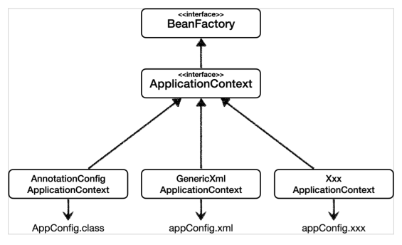
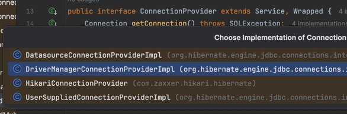

## 팩토리 메서드 패턴
### 장점
- 객체 생성 로직을 캡슐화하여 유연성 확보
- 단일 책임 원칙(SRP) 준수
- 기존 코드 수정 없이 새로운 제품 클래스 추가 가능
### 단점:
- 각 제품마다 팩토리 클래스를 생성해야 해서 클래스 수가 증가
- 간단한 객체 생성에도 복잡한 계층 구조 필요

### 사용 시기
- 객체 생성 시점에서 어떤 클래스의 인스턴스를 만들어야 하는지 모를 때
- 생성할 객체의 명세가 실행 시점에 결정될 때
- 객체 생성 로직이 자주 변경될 가능성이 있을 때

## 추상 팩토리 패턴
### 장점
- 제품군을 쉽게 교체할 수 있음
- 제품 사이의 일관성 보장
- 구체적인 클래스와의 결합도를 낮춤

### 단점
- 새로운 종류의 제품을 추가하기 어려움 (모든 팩토리에 새로운 메서드 추가 필요)
- 패턴 구조가 복잡함

### 사용 시기
- 관련된 객체들의 집합을 생성할 때
- 여러 제품군 중 하나를 선택해서 시스템을 설정해야 할 때
- 제품군을 같이 사용해야 할 때

## 의존성 역전 원칙(DIP)과의 관계
- 고수준 모듈이 저수준 모듈에 의존하지 않고, 둘 다 추상화에 의존
- 클라이언트 코드는 구체적인 클래스가 아닌 추상화된 인터페이스에 의존
- 이를 통해 결합도를 낮추고 유연성을 높임

## 실제로 위 같은 경우들이 사용되고 있는 곳들
### 스프링 프레임워크의 BeanFactory
```java
// BeanFactory - 추상 팩토리 패턴의 예시
public interface BeanFactory {

    Object getBean(String name) throws BeansException;

    <T> T getBean(String name, Class<T> requiredType) throws BeansException;

    Object getBean(String name, Object... args) throws BeansException;

    <T> T getBean(Class<T> requiredType) throws BeansException;

    <T> T getBean(Class<T> requiredType, Object... args) throws BeansException;

    //...
}   
// AbstractApplicationContext - BeanFactory의 구현체
public Object getBean(String name) throws BeansException {
    this.assertBeanFactoryActive();
    return this.getBeanFactory().getBean(name);
}

public <T> T getBean(String name, Class<T> requiredType) throws BeansException {
    this.assertBeanFactoryActive();
    return (T)this.getBeanFactory().getBean(name, requiredType);
}

public Object getBean(String name, Object... args) throws BeansException {
    this.assertBeanFactoryActive();
    return this.getBeanFactory().getBean(name, args);
}
```


- 각각의 getBean 메서드는 팩토리 메서드, 빈의 이름이나 타입이 일치하는 빈을 반환.
- 그런 다음 Spring은 ApplicationContext 인터페이스로 BeanFactory를 확장하여 추가 기능들을 추가하여 구성.
- Bean의 생성, 조회, 관리를 추상화
- 실제 구현은 ApplicationContext 등에서 담당
- 런타임에 필요한 Bean을 동적으로 생성하고 의존성 주입

## Hibernate
```java
public interface ConnectionProvider extends Service, Wrapped {
    Connection getConnection() throws SQLException;

    void closeConnection(Connection var1) throws SQLException;

    boolean supportsAggressiveRelease();
}
```

1. 관련된 객체군 생성
- Connection 객체
- ConnectionReleaseMode
- 트랜잭션 격리 수준 설정
- 커넥션 풀링 관련 설정
- 각종 데이터베이스 리소스

2. 구체적인 구현체 제공
- HikariConnectionProvider
- DataSourceConnectionProvider
- DriverManagerConnectionProvider
- C3P0ConnectionProvider 등
- 각 구현체는 자신만의 방식으로 연관된 객체들을 생성하고 관리

3. 일관된 객체군 생성 보장
- 특정 ConnectionProvider를 선택하면 그에 맞는 모든 설정과 객체들이 일관되게 생성됨
- 예: HikariCP 사용 시 HikariCP의 Connection 풀링, 트랜잭션 관리 등이 모두 함께 적용